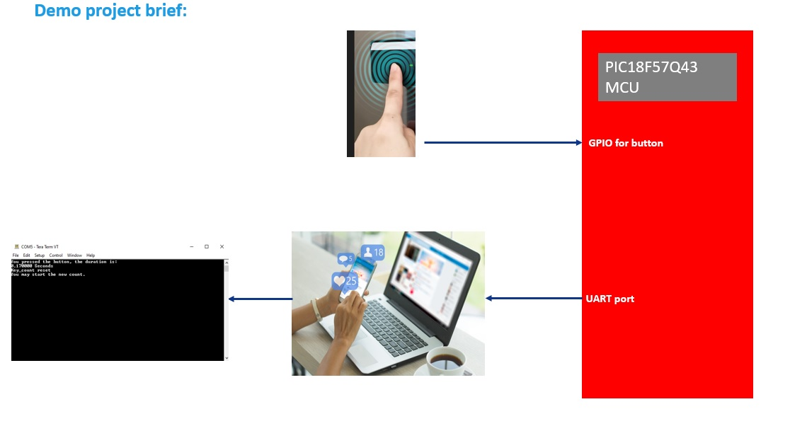
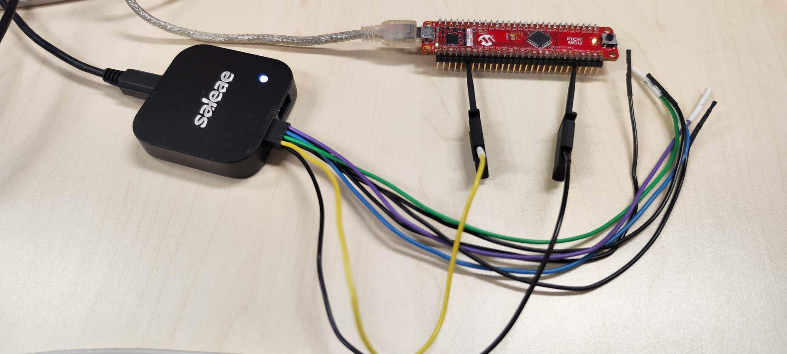
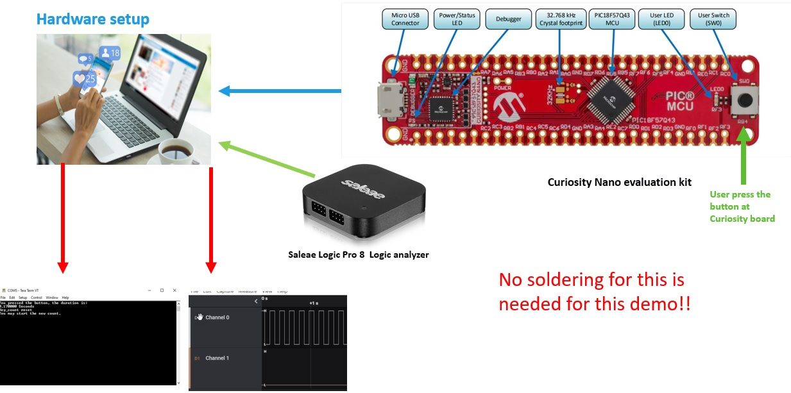
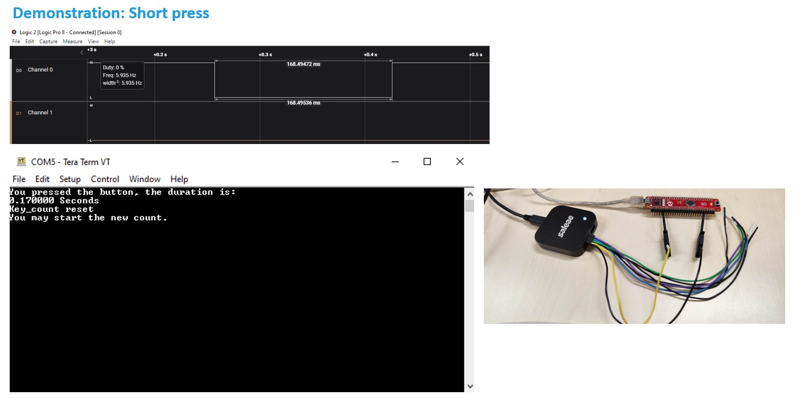
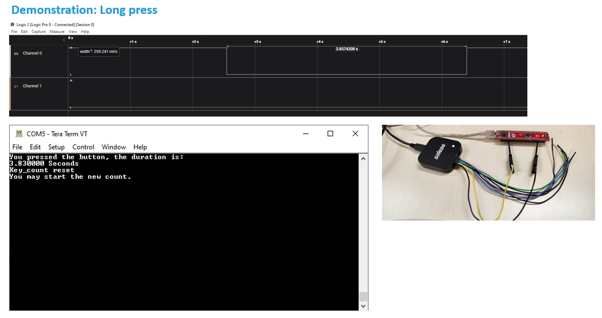

 <article class="markdown-body entry-content p-3 p-md-6" itemprop="This needs to locked down and 'never' changed">

# PIC18F57Q43 Vectored 16Bit Timer Demo using MCC Melody

# Microchip University PIC Interrupt Training Module Demo

## Objective

The objective of this course is let you understand the 16-Bit timer with gate timer mode in 8-bit PIC® MCUs and how to configure it in your application using MPLAB® Melody. 
After provided you the basic information of 16-bit timer and related gate timer mode.
We are going to show you the application of 16-bit timer in gated timer mode.

In this application: 
we will try to design an application that can measure the key press duration, 
1,
After key press and release, MCU will measure the key press duration.
2, 
MCU will send computer the time data via UART.
3,
And display in tera termination.

## Related Documentation

- [PIC18F57Q43 Curiosity Nano Hardware User Guide](https://ww1.microchip.com/downloads/en/DeviceDoc/PIC18F57Q43-Curiosity-Nano-HW-UserGuide-DS40002186B.pdf)
- [PIC18F57Q43 Data Sheet](https://ww1.microchip.com/downloads/en/DeviceDoc/PIC18F27-47-57Q43-Data-Sheet-40002147F.pdf)

## Software Used

- MPLAB® X IDE 6.00 or newer [(microchip.com/mplab/mplab-x-ide)](http://www.microchip.com/mplab/mplab-x-ide)
- MPLAB® XC8 2.35 or newer compiler [(microchip.com/mplab/compilers)](http://www.microchip.com/mplab/compilers)
- MPLAB® Code Configurator (Plugin) v5.1.0 [(microchip.com/mplab/mplab-code-configurator)](https://www.microchip.com/en-us/tools-resources/configure/mplab-code-configurator)
- MPLAB® Data Visualizer 1.3.1113 [(microchip.com/mplab/mplab-data-visualizer)](<https://www.microchip.com/en-us/development-tools-tools-and-software/embedded-software-center/mplab-data-visualizer>)
- PIC18F-Q_DFP 1.13.211

## Hardware Used

- PIC18F57Q43 Curiosity Nano [(DM164150)](https://www.microchip.com/en-us/development-tool/DM164150)
- Personal computer
- Logic Analyzer

## Setup

The PIC18F57Q43 Curiosity Nano Development Board is used as the test platform.
Here is the connection diagram:
 

## Operation

1. Connect the PIC18F57Q43 Curiosity Nano to computer via USB.
[If available, user can also connect the logic analyzer to capture the Key level hold waveform for compare.]
Image 1
 
Image 2
 
2. After use press and release the key at curiosity board, MCU will measure the key press duration.
3. MCU will send computer the time data via UART. And display in tera termination.

## Result

- Demo 1: Key pressed and level hold for short duration.
 

- Demo 2:  Key pressed and level hold for Long duration.
 

